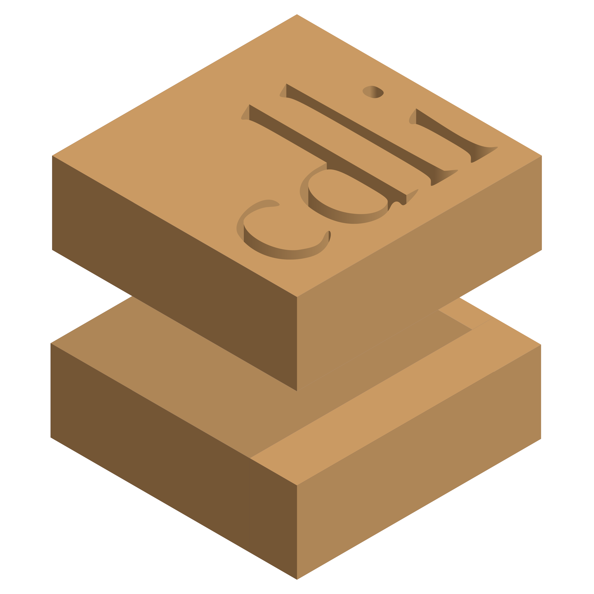
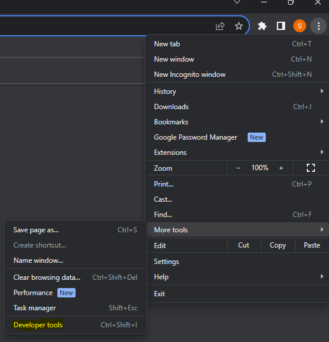
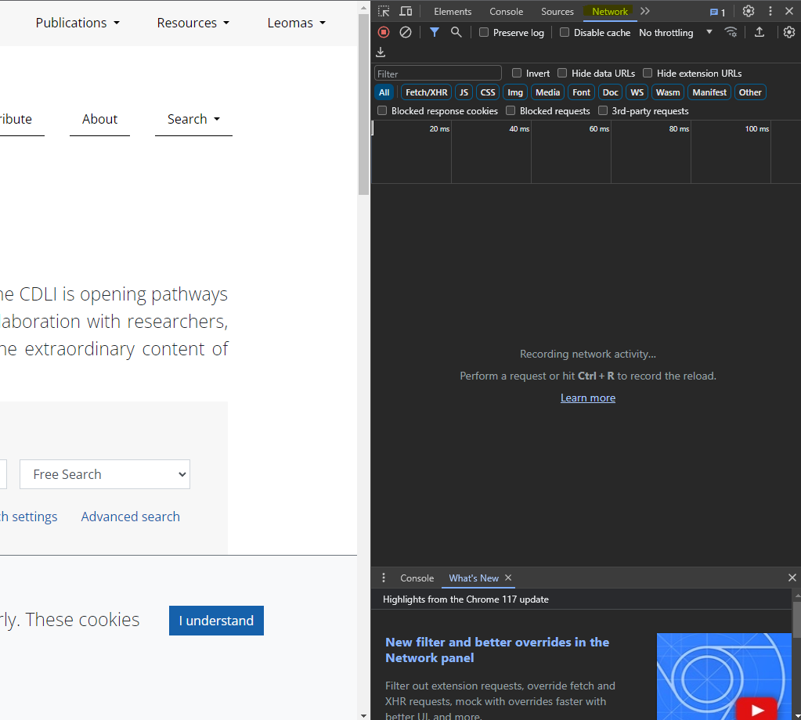
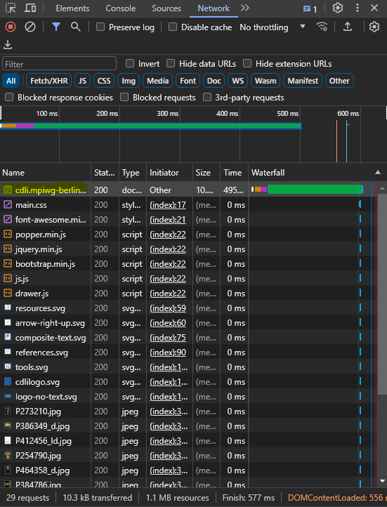
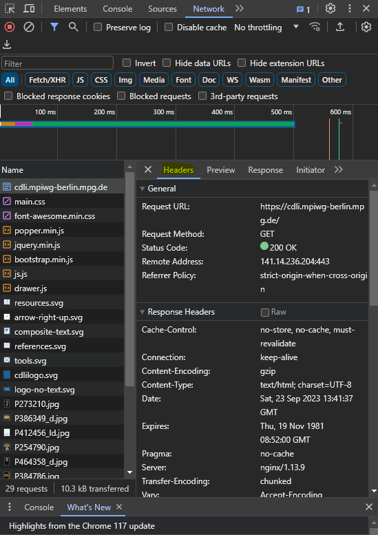
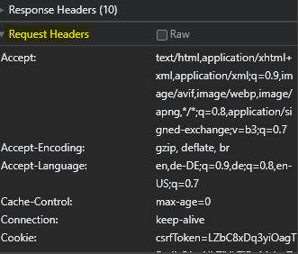
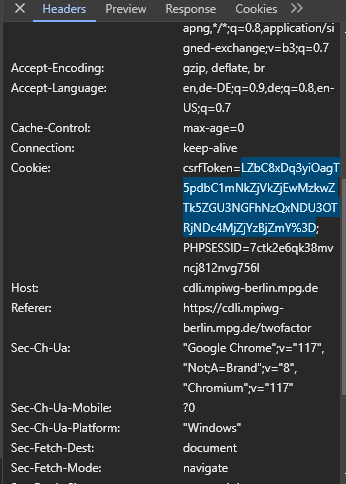

#  Framework API Client

Client for CDLI framework API.

  - [Install](#install)
  - [Getting started](#getting-started)
    - [Command-Line Interface](#command-line-interface)
    - [Programming Interface](#programming-interface)

## Install

A prerequisite for this client is [Node.JS](https://nodejs.org/en/) and a package
manager like [npm](https://npmjs.com), which usually comes with it.

    npm install -g https://github.com/cdli-gh/framework-api-client

Or install it locally into an existing project:

    npm install https://github.com/cdli-gh/framework-api-client

Alternatively, the command can be run with [npx](https://www.npmjs.com/package/npx):

    npx cdli-api-client --help

## Getting started

Right now, the client supports two basic operations:

  - [exporting](#export) parts of the database as linked data (or specifically
    N-Triples). The parts that can be chosen are the types of entities in the
    catalogue, such as artifacts, materials, proveniences, inscriptions and periods.
  - [searching](#search) artifacts in the database.

### Command-Line Interface

    cdli [command]
    
    Commands:
      cdli export  Export catalog and text data
      cdli search  Export catalog and text data
    
    Options:
      --version          Show version number                               [boolean]
      --host, -h         Host URL to use for API calls
                             [string] [default: "https://cdli.mpiwg-berlin.mpg.de/"]
      --format, -f       File format
                      [choices: "ndjson", "csv", "tsv", "ntriples", "bibtex", "atf"]
      --output-file, -o  Output file (outputs to stdout by default)
      --start-page, -s   Page to start at (starts at 1 by default)         [number ]
      --cookie, -c       Cookie obtained after login                    [raw string]  
      --help             Show help                                         [boolean]

#### Export

    cdli export
    
    Export catalog and text data
    
    Options:
      --version          Show version number                               [boolean]
      --host, -h         Host URL to use for API calls
                             [string] [default: "https://cdli.mpiwg-berlin.mpg.de/"]
      --format, -f       File format
                      [choices: "ndjson", "csv", "tsv", "ntriples", "bibtex", "atf"]
      --output-file, -o  Output file (outputs to stdout by default)
      --help             Show help                                         [boolean]
      --entities, -e     Which types of entities to fetch
            [array] [choices:  "archives", "artifacts", "artifact-assets",
                  "artifacts-external-resources", "authors", "collections", "dates",
           "dynasties", "external-resources", "genres", "inscriptions", "languages",
      "materials", "material-aspects", "material-colors", "periods", "proveniences",
                                                "publications", "regions", "rulers"]
      --start-page, -s Page to start at (starts at 1 by default)           [number ]
      --cookie, -c       Cookie obtained after login                    [raw string] 

So to export place-related entities from a locally-running framework instance you
could do this:

    cdli export \
      --host http://localhost:2354/ \
      --entities archives proveniences regions \
      --output-file places.nt

Nota bene:

- for "inscriptions" always use format "atf"
- for "artifacts-external-resources"  always use format "ntriples"
- for "artifacts-external-resources"  always use format "ntriples" and use cookie option (use explained in Authentication)

#### Search

    cdli search
    
    Search artifacts in the catalog
    
    Simple search:
      -q, --query                Search query                                [array]
          --queryCategory, --qc  Search category
            [array] [choices: "keyword", "publication", "collection", "provenience",
                                   "period", "transliteration", "translation", "id"]
          --queryOperator, --qo  Search operator      [array] [choices: "AND", "OR"]
    
    Advanced search:
          --advancedField, --af  Search field                                [array]
          --advancedQuery, --aq  Search query                                [array]
    
    Filter:
          --filterField, --fk  Filter by field                               [array]
          --filterValue, --fv  Filter by value                               [array]
    
    Options:
          --version      Show version number                               [boolean]
      -h, --host         Host URL to use for API calls
                             [string] [default: "https://cdli.mpiwg-berlin.mpg.de/"]
      -f, --format       File format
                      [choices: "ndjson", "csv", "tsv", "ntriples", "bibtex", "atf"]
      -o, --output-file  Output file (outputs to stdout by default)
          --start-page, -s Page to start at (starts at 1 by default)           [number ]
          --help         Show help                                         [boolean]

Example:

    cdli search -q holland --fk genre --fv "Official or display" -f tsv

### Authentication
To download dates it is required to use the cookie option. Here we will explain how to use this option
1) If you do not have an account, go to https://cdli.mpiwg-berlin.mpg.de/register and register on the site.
2) Open web developer tools (Generally under "More Tools")



3) Navigate to Network Menu (orientation of web developer tools may vary)



4) Reload page, your network tab should now a list of network transactions. Click on the first one.



5) A new tile should open up. Here, navigate to headers.



6) Navigate to Request Header.



7) Navigate to cookies and copy csrfToken (everything between = and ;). This is the value for the cookie option.



### Programming Interface

```js
const CDLI = require('cdli-api-client')

const client = new CDLI.Client('http://localhost:2354/')

// process logging
client.on('log', msg => process.stderr.write(msg))

client.export(['archives', 'proveniences', 'regions' ], 'places.nt')
    .then(entities => {
        for (const { status, reason } of entities) {
            if (status === 'rejected') {
                console.error(reason)
            }
        }
    })
```
